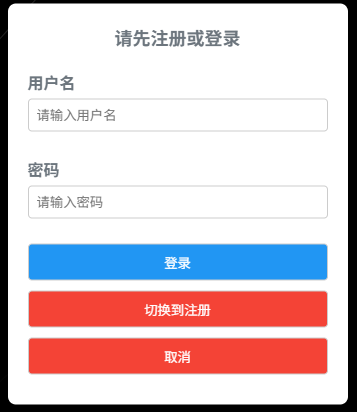
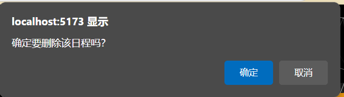
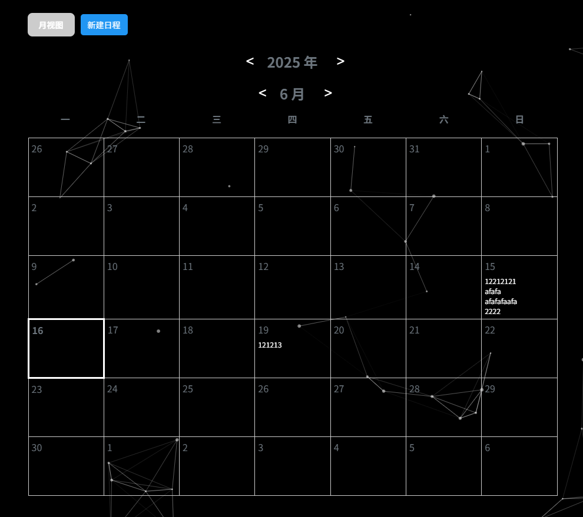
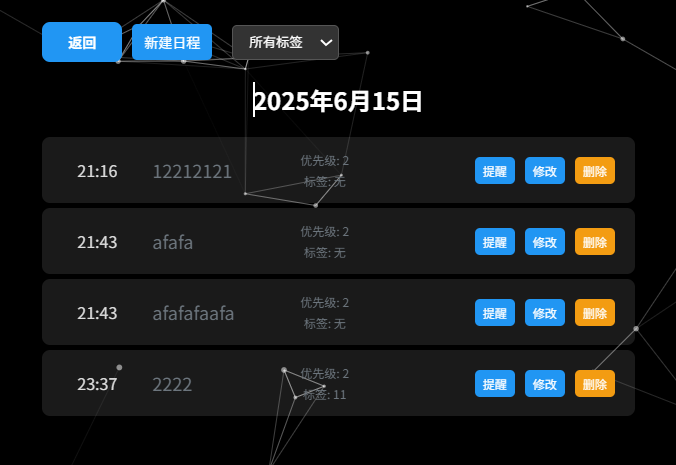
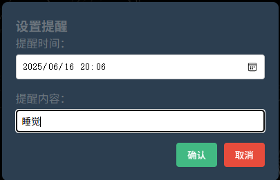
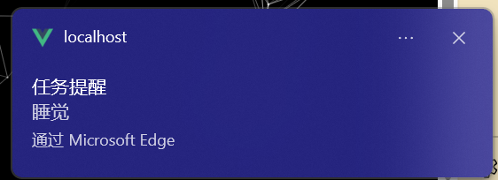
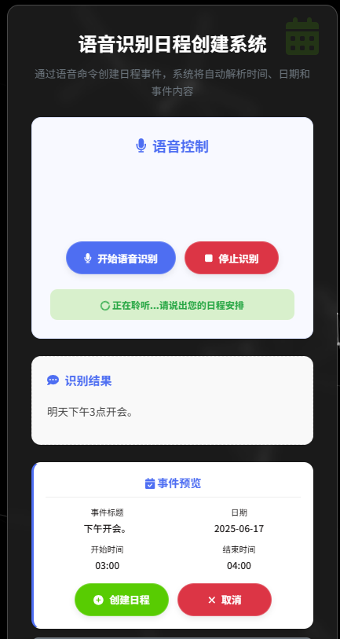
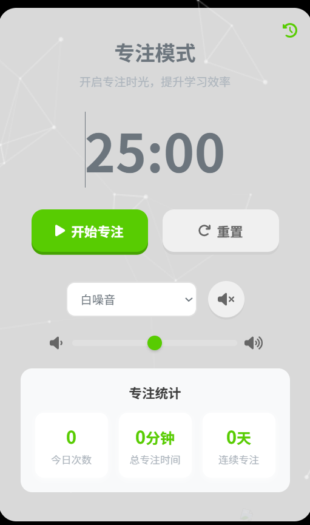

# 交互式便捷日程规划软件
A highly interactive schedule planning software, the final project of the HCI course at Tongji University
一个交互式的日程规划软件，同济大学HCI课程的期末项目

## 项目环境配置
1. 本项目在windows下进行开发，并使用 python3 和 node.js 环境分别作为后端和前端的开发环境。

2. 在项目目录下执行以下指令，下载可能需要一些时间，请耐心等待
   ```bash
   npm install 
   pip install flask flask-cors
   ```
3. 假如网络错误，请配置registry为国内镜像源：
    ```bash
    npm config set registry https://registry.npmmirror.com/
    ```
    或直接在用户目录下的.npmrc文件中配置镜像源
4. 编译并热重载开发环境：
    ```bash
    python backend.py # 启动后端服务
    npm run dev # 启动前端服务
    ```
5. 编译并压缩打包生产环境：
    ```bash
    npm run build 
    ```
6. 权限
   使用弹窗需要先开启通知+弹窗权限
   使用语音输入需要先开启麦克风权限

## 项目功能

### 日程管理

#### 数据库逻辑
1. 使用sqlite3作为数据库

2. 数据库表结构： 日程表：存储日程信息（时间、事件名称、优先级、标签），并与用户表关联
   
3. 数据库操作
   - 后端使用Flask框架提供API接口
   - 前端通过`servicess/BackendService.js`与后端API交互
   - 使用Vuex在`store/index.js`中管理应用状态
   

#### 登录

1. **前端实现**： 用户输入用户名和密码后，点击登录按钮触发 `handleSubmit` 方法。

2. **后端实现**： 验证用户凭据并返回用户 ID。

3. **状态管理**： 使用 Vuex 在 `src/store/index.js` 中管理登录状态。



#### 日程的增删改查

1. **添加日程**： 用户可以通过 `ScheduleForm.vue` 组件添加新的日程，在表单中填写事件名称、时间、优先级和标签后，点击提交按钮完成添加。

2. **修改日程**： 用户可以通过点击日程列表中的编辑按钮，打开 `ScheduleForm.vue` 组件以修改日程。

3. **删除日程**： 用户可以通过点击日程列表中的删除按钮，直接删除日程。



1. **查看日程**：
   - 用户可以在 `ScheduleView.vue` 中查看日程列表，支持按月和按日两种视图模式。
   - **每月日程界面**：
     - **日历组件**：显示当前月份的日历，包含日期单元格。
     - **日期单元格**：每个单元格显示日期及对应的日程任务列表，当前日期高亮显示。
     - **导航控件**：提供切换月份和年份的按钮。
     
   
   
   - **每日日程界面**：
     - **标题组件**：显示当前选定日期。
     - **任务列表组件**：列出当天的所有任务，包含任务时间、名称、标签等信息。
     - **操作按钮**：提供添加、编辑、删除任务的功能。
     - 日程数据通过 `fetchEvents` 方法从后端 API `/events` 获取，并动态渲染到界面中。
   
   
   
#### 设定提醒
用户可以通过弹窗设置提醒时间和提醒内容，时间到后会通过浏览器的通知 API 弹出提醒。
  



   
#### 标签搜索
用户可以通过标签对日程进行分类和搜索，标签可以在添加或编辑日程时设置，用户可以在日程列表中通过标签进行筛选。

#### 通过语音添加日程
用户可以通过语音输入来添加日程，使用浏览器的语音识别API实现。用户点击语音输入按钮后，系统会开始监听用户的语音输入，并将识别到的内容填入日程表单中。在用户确认创建日程后就会将语音识别的内容作为日程名称添加到日程列表中。



### 专注模式



#### 专注计时
专注计时功能允许用户设置专注时间和休息时间，使用浏览器的计时器API实现。用户可以在专注模式界面中设置专注时间和休息时间，点击开始按钮后，系统会开始计时，并在计时结束后弹出提醒。

#### 白噪音播放
专注模式中提供了白噪音播放功能，用户可以选择不同的白噪音类型进行播放，帮助用户集中注意力。

#### 专注统计
专注模式中提供了专注统计功能，用户可以查看当天的专注时间和休息时间，帮助用户了解自己的专注情况。

### 虚拟形象
#### Live2D模型展示
本部分功能通过一个fork自[Live2D-Widget](https://github.com/stevenjoezhang/live2d-widget)的[仓库](https://github.com/zuolingxu/live2d-widget/tree/master)实现，提供了一个虚拟形象的展示和交互界面。


#### 虚拟形象工具栏
1. **跳转到主界面**： 会跳转到主界面。
2. **小游戏**： 会调用一个浏览器界面小游戏[kick ass](https://kickassapp.com/?route=%2F)，帮助用户放松心情
3. **随机激励话语**： 会通过虚拟形象随机展示一些激励的话语，帮助用户保持积极的心态
4. **查看最近的日程**： 会通过虚拟形象告知用户最近的三个日程安排
5. **查看代码仓库**： 自动跳转到本仓库
6. **关闭模型**： 关闭虚拟形象模型，会在页面最左侧显示一个小图标，点击后可以重新打开模型

#### 通过虚拟形象提供反馈
对于用户的绝大部分操作，通过虚拟形象的对话框进行反馈，避免了使用浏览器通知API进行反馈的需要进行确认繁琐，保证了交互的连贯性，UI设计的美观与反馈的及时性。


声明：本项目使用的live2d模型仅用于展示。

